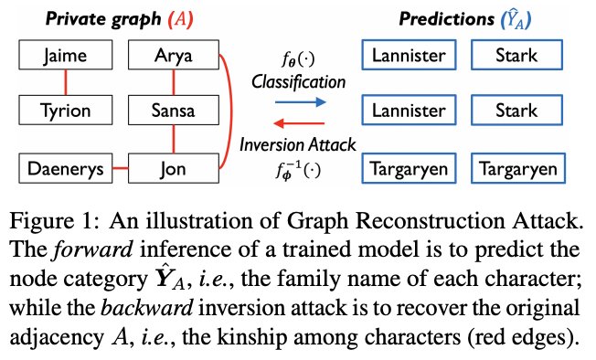
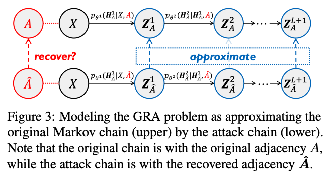
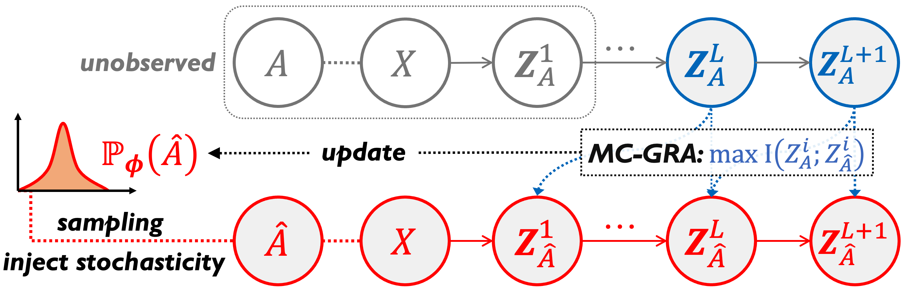
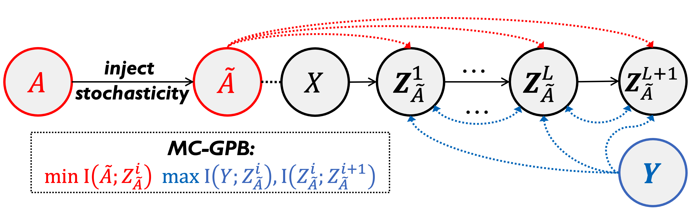
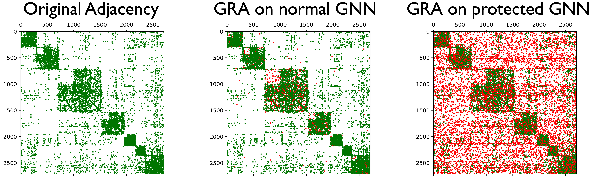

<p align="center"></p>
<!-- <h1 align="center"> MC-GRA </h1> -->

<!-- <p align="center">
    <a href="TODO: arxiv"></a>
    <a href="https://github.com/AndrewZhou924/MC-GRA"></a>
    <a href="TODO: mlr">  </a>
    
    
</p> -->
<!-- *logo created by NewBing -->

<!-- **Blogs ([English(TODO)](-) - [中文(TODO)](-))** |
**[Slides(TODO)](-)** |
**[Poster(TODO)](-)** -->

<!-- <h1 align="center"> -->
Official code for the paper "On Strengthening and Defending Graph Reconstruction Attack with Markov Chain Approximation" (ICML 2023).
<!-- </h1> -->
<!-- <p align="center"> -->
<a href="https://arxiv.org/abs/2306.09104"></a>
<a href="https://openreview.net/pdf?id=Vcl3qckVyh"></a>
<a href="https://github.com/AndrewZhou924/MC-GRA"></a>
<a href="https://slideslive.com/39003755/on-strengthening-and-defending-graph-reconstruction-attack-with-markov-chain-approximation?ref=search-presentations-On+Strengthening+and+Defending+Graph+Reconstruction+Attack+with+Markov+Chain+Approximation"></a>

<!-- </p> -->

## Introduction
We perform the first comprehensive study of graph reconstruction attack that aims to reconstruct the adjacency of nodes, and show that a range of factors in GNNs can lead to the surprising leakage of private links. 

Specially, by taking GNNs as a **Markov chain** and attacking GNNs via a flexible **chain approximation**, we systematically explore the underneath principles of graph reconstruction attack, and propose two information theory-guided mechanisms: 

(1) MC-GRA: the chain-based attack method with adaptive designs for extracting more private information; 

(2) MC-GPB: the chain-based defense method that reduces the attack fidelity with moderate accuracy loss. 

Such two objectives disclose a critical belief that to recover better in attack, you must extract more multi-aspect knowledge from the trained GNN, while to learn safer for defense, you must forget more link-sensitive information in training GNNs. That is, *To Recover Better, You Must Extract More; To Learn Safer, You Must Forget More.*

<table><tr>
<td></td>
<td></td>
</tr></table>
<p align="center"><em>Figure 1.</em> Problem definition and method.</p>

<table><tr>
<td></td>
<td></td>
</tr></table>
<p align="center"><em>Figure 2.</em> The workflow of MC-GRA (left) and MC-GPB (right).</p>

Empirically, we achieve state-of-the-art results on six datasets and three common GNNs (see exemplars below).

<p align="center"></p>
<p align="center"><em>Figure 3.</em> Recovered adjacency on Cora. Green dots are correctly predicted edges while red dots are wrong ones.</p>

## Installation
We have tested our code on `Python 3.8` with `PyTorch 1.12.1`, `PyG 2.2.0` and `CUDA 11.3`. Please follow the following steps to create a virtual environment and install the required packages.

Create a virtual environment:
```
conda create --name mc_gra python=3.8 -y
conda activate mc_gra
```

Install dependencies:
```
pip install -r requirements.txt
```

## Reprodution
We provide examples for MC-GRA and MC-GPB to reproduce the results as follows.

### MC-GRA

Prepare data
```bash
cd MC-GRA
unzip saved_data.zip
```

The full command and hyperparameters for MC-GRA can be found in [MC-GRA commands](MC-GRA/README.md). 

For example, to train the MC-GRA (in `MC-GRA/`) with given all three prior (i.e., $\mathcal{K}=[H_A, Y_A, Y]$) on Cora dataset: 
  ``` bash
  python main.py --w1=0.01 --w6=10 --w7=10 --w9=10 --w10=1000 --lr=-2 --useH_A --useY_A --useY --measure=MSELoss --dataset=cora
  ```

### MC-GPB
The full command and hyperparameters for MC-GPB can be found in [MC-GPB commands](MC-GPB/README.md). 

For example, to train a general GNN with MC-GPB (in `MC-GPB/`) on Cora dataset: 
  ``` bash
  python main_table.py --dataset=cora --aug_pe=0.17 --layer_MI=3.2 0.77 0.02 --layer_inter_MI=0.27 0.96 --device=cuda:0
  ```

## Citation

If you find our work useful, please kindly cite our paper:

```bibtex
@inproceedings{zhou2023mcgra,
  title       = {On Strengthening and Defending Graph Reconstruction Attack with Markov Chain Approximation},
  author      = {Zhanke Zhou and Chenyu Zhou and Xuan Li and Jiangchao Yao and Quanming Yao and Bo Han},
  booktitle   = {International Conference on Machine Learning},
  year        = {2023}
}
```
